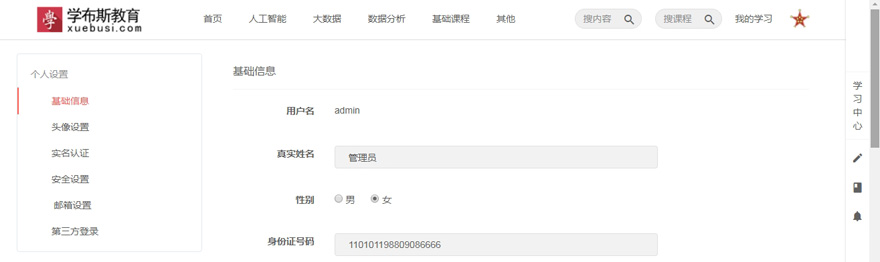

## xstrap

## 项目简介
    该项目前端是高仿某在线教育网站，后端采用Java编写。
    包含登录、注册、课程列表、课程详情、课时、视频播放、订单等在线视频教育网站所有的模块。
    目前项目刚刚启动，很多模块都尚未实现，正在一步一步完善中……

## 所用技术
    SpringBoot、SpringData JPA、BootStrap、FreeMarker、MySQL。

## 演示效果图

1.首页

2.详情页

3.登录页

4.我的学习课程

5.个人设置

## 加入我们
    本项目完全开源，欢迎感兴趣的小伙伴加入我们，能力不限，当做是业余时间练手，相互学习、共同进步。
    我们不要求你技术有多牛逼，当然更欢迎技术大牛的参与！目的是共同打造一款Java语言中最牛逼的开源在线教育平台。
    联系邮件：490983587@qq.com
    或者扫描下面二维码，加我微信：
    

